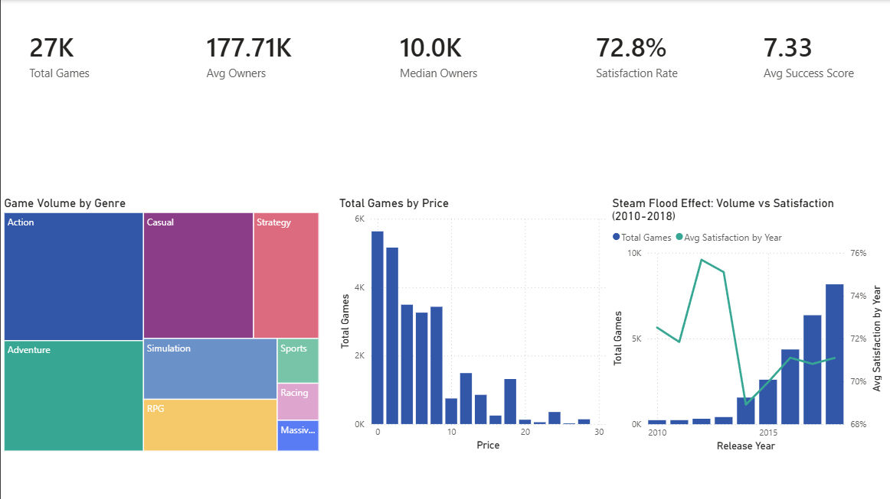
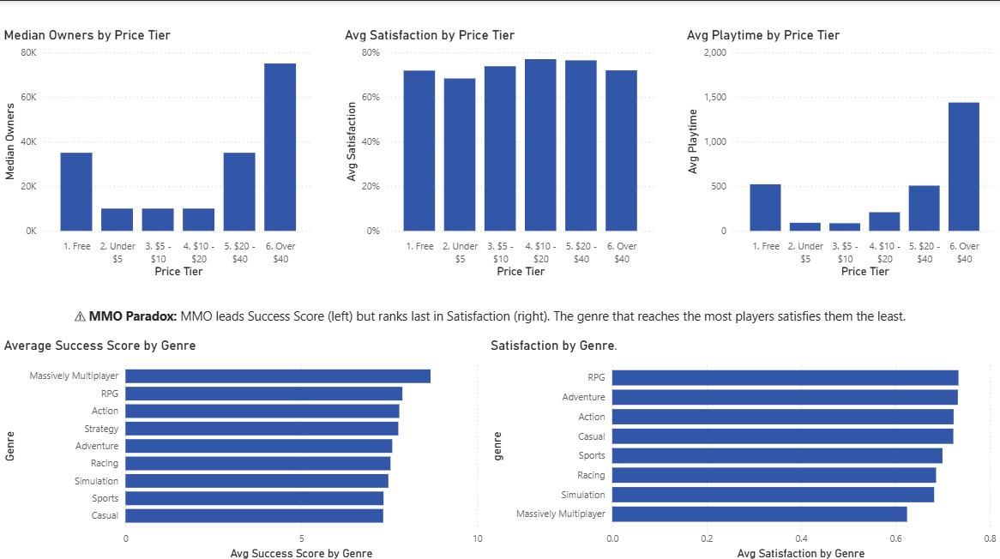
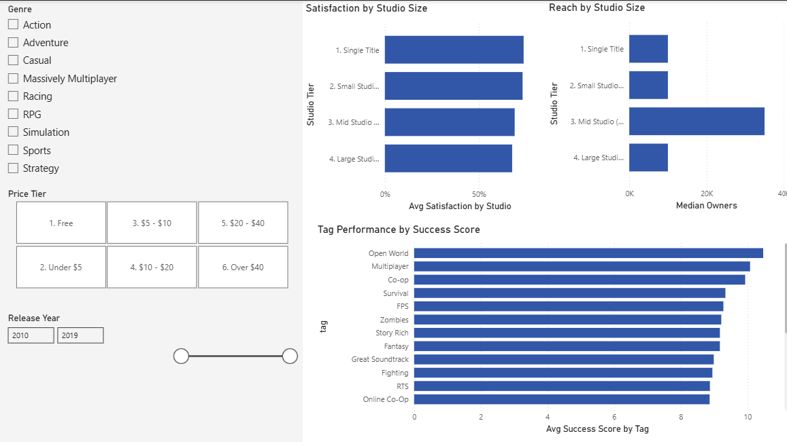

# 🎮 Steam Game Success Analysis

> *What makes a Steam game successful — and why?*

A data analysis project examining 27,075 Steam games to uncover 
the patterns behind game success. Built with a SQL-first pipeline, 
statistical testing, and interactive Power BI dashboard.

---

## 🎯 The Central Question

Most Steam analysis projects ask *what* succeeded. This project asks *why*.

Using a normalized SQLite database, statistical hypothesis testing, and 
domain knowledge as a gamer, this analysis identifies the measurable 
drivers of reach and satisfaction across Steam's catalog from 1998-2019.

---

## 🛠 Tech Stack & Pipeline

| Stage | Tool | Purpose |
|-------|------|---------|
| Data Cleaning | Python, pandas, numpy | Structural cleaning, feature engineering |
| Database | SQLite | Normalized relational storage |
| Analysis | SQL (SQLite) | Aggregations, window functions, CTEs |
| EDA | matplotlib, seaborn | Visual pattern discovery |
| Statistics | scipy, statsmodels | Hypothesis testing, regression |
| Dashboard | Power BI | Interactive insight presentation |

**Pipeline:**
Raw CSV → Python cleaning → SQLite (4 tables) → SQL analysis → Power BI dashboard

This means SQL was the primary analysis tool, not pandas. Python only handled 
what SQL couldn't — parsing semicolon-delimited columns and feature engineering. 
Everything else lives in the database.

---

## 📁 Project Structure
steam-success-analysis/

├── data/

│   ├── raw/          ← original Kaggle CSV (not tracked by git)

│   ├── processed/    ← cleaned CSVs exported from SQL analysis

│   └── database/     ← steam.db SQLite database (not tracked by git)

├── notebooks/

│   ├── 01_data_ingestion.ipynb

│   ├── 02_sql_analysis.ipynb

│   ├── 03_eda_visualizations.ipynb

│   ├── 04_statistical_tests.ipynb

│   └── 05_insight_storytelling.ipynb

├── sql/

│   ├── 01_genre_performance.sql

│   ├── 02_price_tier_analysis.sql

│   ├── 03_top_games_per_genre.sql

│   └── 04_developer_comparison.sql

├── powerbi/          ← steam-success-analysis.pbix

├── reports/          ← exported charts

├── assets/           ← dashboard screenshots

└── README.md

---

## 🔍 Key Findings

### 1. The Steam Flood Effect
Between 2010 and 2018, Steam game releases increased 8x after Valve removed 
publishing barriers with Steam Greenlight (2012) and Steam Direct (2017). 
Average player satisfaction declined consistently as low-effort titles flooded 
the platform. A genuinely good game released in 2018 competed with 8x more 
titles than one released in 2010 — making discoverability as important as quality.

*Games like Hellblade: Senua's Sacrifice and INSIDE were excellent but had to 
fight for visibility in an increasingly crowded marketplace.*

### 2. Free Games Reach More, Satisfy Equally
Free games have 3.5x more median owners than paid games. Yet player satisfaction 
is statistically identical across both models (Mann-Whitney U test, p≈0). Price 
is a barrier to entry on Steam, not a quality signal. Both Dota 2 (free, 150M owners) 
and Portal (paid, 15M owners) achieve near-identical satisfaction scores.

### 3. The $10–$20 Sweet Spot
Among paid games, the $10–$20 tier has the highest player satisfaction (77.0%). 
The Under $5 tier is the worst performing — lowest reach AND lowest satisfaction. 
A cheap price signals low quality before players even launch the game. Games like 
Skyrim ($12.69) and Euro Truck Simulator 2 ($19.04) demonstrate that players 
willingly pay for perceived value.

### 4. Genre Satisfaction Hierarchy
Genre significantly affects player satisfaction (Kruskal-Wallis H=493, p≈0). 
RPG and Adventure games lead with ~76-77% positive ratios. Massively Multiplayer 
trails every genre at 64.1% — despite having the highest success score. MMOs reach 
the most players but satisfy them the least. Pay-to-win mechanics, content droughts, 
and toxic communities consistently erode player trust.

### 5. Co-op is the Golden Tag
Co-op is the only tag combining high reach (1.7M avg owners) AND high satisfaction 
(81.6% positive ratio). All other high-reach tags sacrifice one for the other. 
Co-op games like Portal 2, Left 4 Dead 2, and Don't Starve Together turn every 
player into a marketing channel — you can't play them alone, so you bring a friend.

### 6. Small Studios Punch Above Their Weight
Large studios (20+ games) have significantly higher median reach than single-title 
developers. Yet player satisfaction is virtually identical across all studio sizes. 
Studio size buys reach, not quality. Stardew Valley (1 person), Terraria (2 people), 
Factorio, and RimWorld all achieved legendary status from tiny teams — proving the 
barrier to making a beloved game is talent and passion, not headcount or budget.

### 7. The 96% Mystery
OLS Regression using price, genre, playtime, achievements, and release year 
explains only 4.26% of variation in player satisfaction (R² = 0.0426). The 
remaining 96% is driven by intangibles no dataset can capture — writing quality, 
art direction, game feel, music, and developer passion. Data can tell you what 
genre to build in and what price to charge. It cannot tell you how to make a 
great game. That's why game development remains an art, not a formula.

---

## 📊 Statistical Validation

Three formal tests back up the visual patterns:

**Mann-Whitney U Test** — Free vs Paid reach
- Result: Statistically significant (p≈0)
- Finding: Free games genuinely reach more players — not a sampling artifact

**Kruskal-Wallis Test** — Satisfaction across genres  
- H statistic: 493.47, p≈0
- Finding: Genre differences in satisfaction are real, not random variation

**OLS Regression** — Predicting player satisfaction
- R² = 0.0426
- Key coefficients: Massively Multiplayer (-0.077), price (+0.031)
- Finding: Measurable features explain very little — intangibles dominate

Non-parametric tests were chosen because owner counts and satisfaction 
distributions are heavily skewed — not normally distributed.

---

## ⚠️ Methodology & Limitations

**Success Score** is a proxy metric built from owner_midpoint (70%) and 
average_playtime (30%). It measures reach and engagement — not revenue, 
which would be the ideal metric but isn't available in this dataset.

**Owner counts** are estimates from SteamSpy buckets (e.g. "200,000–500,000"), 
not exact figures. Midpoints are used as approximations.

**Mean vs Median** — Owner counts use median in the dashboard due to extreme 
skew caused by mega-hits like Dota 2 (150M owners). Satisfaction and playtime 
use mean for consistency with the statistical analysis.

**Dataset scope** — Covers Steam's catalog through 2019. Post-2019 trends 
(COVID gaming boom, Steam Deck, AI-generated content flood) are not captured. 
The core patterns identified likely persist but would benefit from validation 
against a more recent dataset.

**Prices** are converted from GBP to USD at a fixed rate of 1.27. Historical 
exchange rate variation is not accounted for.

---

## 🚀 How to Run

**Prerequisites:** Python 3.8+, Git, Power BI Desktop

```bash
# clone the repo
git clone https://github.com/najeer04/steam-success-analysis.git
cd steam-success-analysis

# create virtual environment
python -m venv venv
venv\Scripts\activate  # Windows

# install dependencies
pip install -r requirements.txt

# download dataset
# Go to https://www.kaggle.com/datasets/nikdavis/steam-store-games
# Place steam.csv in data/raw/

# run notebooks in order
# 01_data_ingestion.ipynb  ← creates the SQLite database
# 02_sql_analysis.ipynb    ← runs SQL analysis
# 03_eda_visualizations.ipynb
# 04_statistical_tests.ipynb
# 05_insight_storytelling.ipynb
```

---

## 📈 Dashboard

The Power BI dashboard has three pages:

**Page 1 — Market Overview**
High-level KPIs, genre distribution treemap, price distribution, and the Steam 
Flood Effect trend chart.


**Page 2 — Success Drivers**
Price tier analysis across reach, satisfaction and playtime. Genre comparison 
showing the MMO paradox — highest reach, lowest satisfaction.


**Page 3 — Deep Dive**
Interactive slicers for genre, price tier, and release year. Tag performance 
rankings and studio size comparison. All charts update dynamically with filters.


---

## 📦 Dataset

- **Source:** [Steam Store Games — Kaggle](https://www.kaggle.com/datasets/nikdavis/steam-store-games)
- **Size:** 27,075 games, 18 features
- **Coverage:** Steam catalog through 2019
- **License:** CC0 Public Domain

---

## 👤 Author

**Najeer**
Data Analyst | Gamer | Portfolio Project 2024

*This project was intentionally built after a prior Steam success predictor 
project raised the question: why do certain features predict success? 
This analysis answers that question.*

---